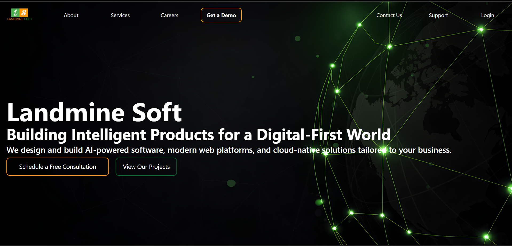
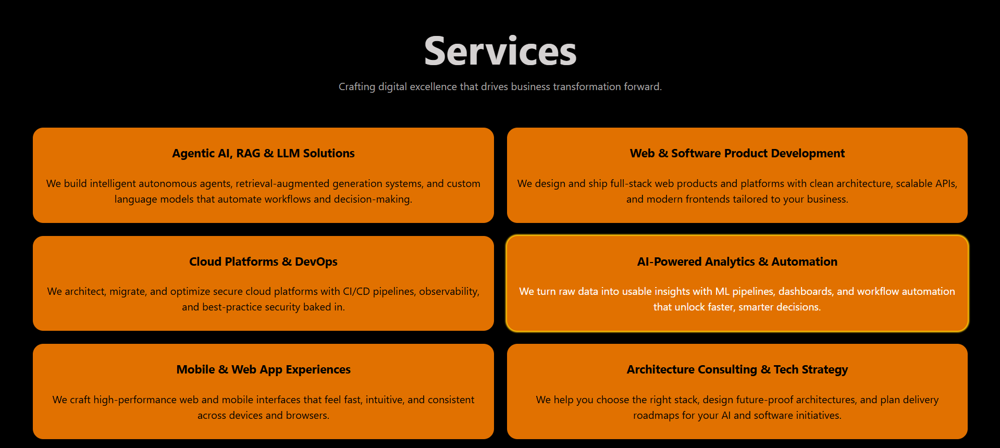
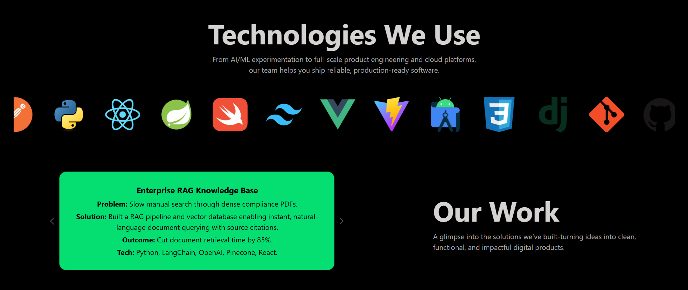

# Landmine Soft Frontend Developer Internship Project 
- Complete Frontend Website For Landmine Soft Hyderabad. 
- A modern and responsive IT/Software Agency website built using React(Vite) and Tailwind CSS.

## Project Overview 

  It is a fully responsive frontend project which was assigned as the Final Assignment for the Frontend Developer Internship. The project is developed with attention to detail, "will it attract clients ?" mindset, modern layout & design, and using latest frontend technologies.

  The project is built to attract clients such as businesses looking for an agency for their projects, startups and individuals looking for a professional platform to showcase their products or services. Most importantly for the clients or businesses to enquire the company, explore its history, values, team members, company's work & contribution, and contact information.

  The goal of the project is to create a professional online presence with smooth animations, responsive design, and a clean user experience.

## Features

 - Deep Black Theme with tasteful accents to make the page modern and techy.
 - Fully responsive to any screen from Mobiles to Desktops.
 - Smooth animations and scrolls.
 - Hover effects for attention and highlight.
 - Clean and smooth UI/UX experience.

## Pages Implemented

 - Main Homepage/Welcome Page.
 - About page.
 - Services page.
 - Careers page.
 - Contact us page.
 - Support/Raise Ticket page.
 - Login + Forgot Password + Register page.
 - FAQs page.
 - Privacy & Policy page.
 - Terms & Conditions page.

## Tech Stack

 - React (Vite)
 - Tailwind CSS
 - React Router DOM

## Folder Structure

```text
project-folder/
├── public/
|  ├── tech/icons
|  ├── meeting/images
|  └── images
├──src/
|  ├── components/ all the pages such as navbar.jsx, footer.jsx etc.
|  ├── App.css
|  ├── App.jsx
|  ├── index.css
|  └── main.jsx
├── index.html
├── package-lock.json
├── package.json
├── tailwind.config.js
└── vite.config.js
 
```

## Steps To Run The Project Locally

- 1. Open VS Code and run:
      ```
        npm create vite@latest
       ```
      - press 'y'
      - type the project name
      - select React
      - select Javascript
      - select use rolldown-vite 'no'
      - select install with npm and start now? 'yes'
      - the project is created.
        
- 2. Navigate to project folder with 'cd' command.
     
- 3. Install Tailwind CSS:
      ```
        npm install tailwindcss @tailwindcss/vite
      ```
      
- 4. Install React Router:
      ```
       npm i react-router-dom
      ```
      
- 5. Download all the files given in the ```main``` branch.
      - replace the entire ```public``` folder with the one provided in the repository.
      - create a ```components``` folder in ```project-folder/src/``` and place the the files in it.
      - replace ```App.jsx```, ```index.css```, ```main.jsx```, ```index.html```, ```package.json```, ```tailwind.config.js```, ```vite.config.js``` with the ones provided.
        
- 6. Ensure all required dependencies listed in ```package.json``` are installed using ```npm install```.
     
- 7. Run the project
      ```
       npm run dev
      ```
- 8. To build
      ```
       npm run build
      ```
- Or:
  
- ## Installation

```bash
git clone https://github.com/GulamMurtuzaHussain/Landmine-Soft-Internship-Project.git
cd Landmine-Soft-Internship-Project
npm install
npm run dev
```

## Build For Production

```bash
npm run build
```

## Screenshots





## Live Demo

 [Visit the Website](https://gulammurtuzahussain.github.io/Landmine-Soft-Internship-Project/#/)

## Author
Gulam Murtuza Hussain

## Contact Author

📧 mail: gulamamir872@gmail.com  

💼 LinkedIn: [Gulam Murtuza Hussain](https://linkedin.com/in/gulam-murtuza-hussain-503745325)

💻 GitHub: [GulamMurtuzaHussain](https://github.com/GulamMurtuzaHussain)

Built with React, Tailwind CSS, and an unreasonable amount of late-night debugging.
